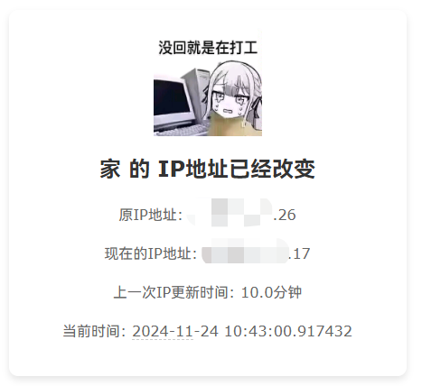

# Automatic Check Public IP address And Push Notifications
## 自动检测公网IP并发送通知
这个程序是一个用于动态公网地址检测的Python脚本。它通过公共API获取当前的公网IP地址，并与上一次检测到的IP地址进行比较。如果IP地址发生变化，程序会发送一封包含新IP地址的邮件通知。邮件使用SMTP协议发送，邮件模板使用HTML语法，包含当前IP地址、之前的IP地址、邮件发送时间和当前时间。
 | [English](./README_EN.md) | [简体中文](./README.md) |
   
    

## 说明

1. 检查当前公网IP地址是否与上一次检测到的IP地址相同。如果相同，则不进行任何操作。
2. 如果不同，用新的IP地址写入变量，通过固定的邮件模板发送邮件给指定的邮箱地址。邮箱使用SMTP协议。

## 功能
1. 通过公共API(api.ip.sb)获取现在的公网IPV4地址。
    也可以通过预配置json文件获取公共api列表，格式为：{"requsetServer_meitu": {"url": "https://webapi-pc.meitu.com/common/ip_location","requsetServer_ipcn": {"url": "https://www.ip.cn/api/index?ip=&type=0"}
2. 每5分钟检测一次IP地址是否发生变化0。
3. 通过SMTP协议发送更换后的IP地址邮件。
4. 邮件模板使用HTML语法，包含当前IP地址、之前的IP地址、邮件发送时间和当前时间。

## 实现功能
- [x] 获取当前公网IP地址
- [x] 检测IP地址是否发生变化
- [x] 发送邮件通知
- [x] 邮件模板使用HTML语法
- [x] 邮件模板包含当前IP地址、之前的IP地址、邮件发送时间和当前时间
- [x] IP使用时间记录正在修复中，现在会显示为 10 分钟
- [ ] 接入不同通知方式
- [ ] 邮件模板支持不同格式，如纯文本、Markdown等
- [ ] 添加日志记录
- [ ] 记录离线日志


## 预配置信息
!!! note 注意
    预配置信息在程序中的config变量中，注意修改。
    配置格式如下
    配置格式如下
    ```json
    config = {
    "smtp": {
        "server": "smtp.163.com", # 发信服务器地址
        "port": 465, # 发信服务器端口
        "username": "maverick@163.com", # 发信邮箱账号
        "password": "ZDkg8yLUDTr4nV8j", # 发信邮箱密码，通常为生成的授权码
        "use_ssl": True # 启用SSL加密
    },
    "email": {
        "to_address": "testemailaddr@gmail.com",  # 收信邮箱账号
        "from_address": "sendmailaddr@163.com",  # 发信邮箱账号
        "subject": "家的公网IP地址已经修改为{now_ip}"   # 邮件主题
    },
    "api_server": {
        "name": "pconline", # 默认API 感谢太平洋电脑网提供的API
        "url": "https://whois.pconline.com.cn/ipJson.jsp?ip=&json=true"
    },
    "check_interval_seconds": 600  # 单位为秒，检测间隔时间
    }
    ```

## 邮件内容
邮件内容包含当前IP地址、之前的IP地址、邮件发送时间和当前时间。
可以自己修改，在程序中`send_email`函数中修改
默认的邮件内容预览



## 程序环境
    Python 3.10


## 特别鸣谢
* [pconline](https://whois.pconline.com.cn/ipJson.jsp?ip=&json=true) 感谢太平洋电脑网提供的API
* [api.ip.sb](https://api.ip.sb/geoip) 感谢api.ip.sb提供的API
* [jetBrains PyCharm](https://www.jetbrains.com/pycharm/) 感谢jetBrains提供的IDE

     
